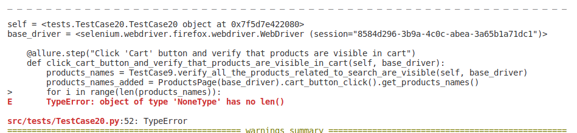

# ERRORS ENCOUNTERED DURING TESTING AND SOLUTIONS
### 1.RecursionError: maximum recursion depth exceeded

The error message `RecursionError: maximum recursion depth exceeded` is indicating that the `get_alert_success()` method is calling itself indefinitely, leading to a recursion loop.
In the `get_alert_success()` method,   `self.get_alert_success()` is being called, which is the same method. This is causing the recursion.

#### Code: 
```
def get_alert_success(self):
    self.get_alert_success()
    return self.alert_success


```

#### Solution:
```
def get_alert_success(self):
    self.alert_success = WebDriverWait(self.driver, 10).until(
        EC.presence_of_element_located((By.CSS_SELECTOR, ".status.alert.alert-success"))
    )
    return self.alert_success.text
```
In this code, `get_alert_success()` waits until the success alert is present, then returns its text. This should fix the recursion error

### 2. 'NoneType' object has no attribute
The error message ` 'NoneType' object has no attribute 'ok_button_click' ` is indicating that the `submit_button_click()` method is not returning an object, hence `None` is returned.

#### Code: 
```
def submit_button_click(self):
    self.get_submit_button().click()
```
In the `submit_button_click()` method, it's not returning self. This is why I got `None` when I try to chain `ok_button_click()` after `submit_button_click()`.

#### Solution:
```
def submit_button_click(self):
    self.get_submit_button().click()
    return self
```
Now, `submit_button_click()` returns the instance of the class, allowing me to chain the method calls.

### 3. Element is not clickable at point because another element obscures it
#### Example 1:
The error message `Element <input class="btn btn-primary pull-left submit_form" name="submit" type="submit"> is not clickable at point (164,643) because another element <div id="aswift_2_host"> obscures it ` suggests that the submit button is being obscured by another element when Selenium tries to click it.
One way to handle this is to use JavaScript to click the button. WebDriver provides an execute_script() method to execute JavaScript code.
#### Solution: 
```
def submit_button_click(self):
    submit_button = self.get_submit_button()
    self.driver.execute_script("arguments[0].click();", submit_button)
    return self
```
In this code, `arguments[0].click();` is a JavaScript command that clicks the first argument passed to it. The `execute_script()` method runs this command, passing submit_button as the argument. This will click the `submit button` even if it's obscured by another element.


### 4.  TypeError: object of type 'NoneType' has no len()


#### Solution:
